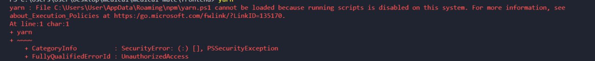
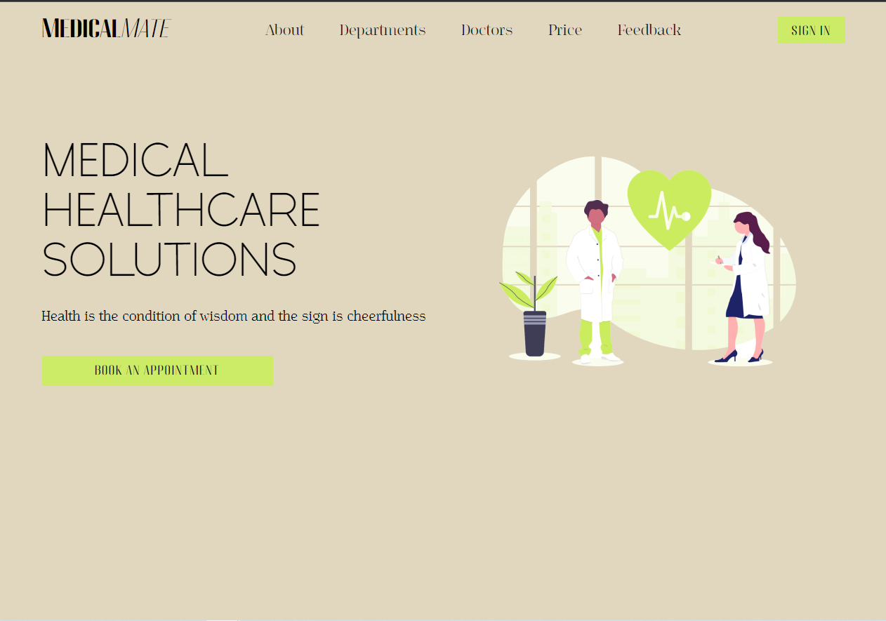
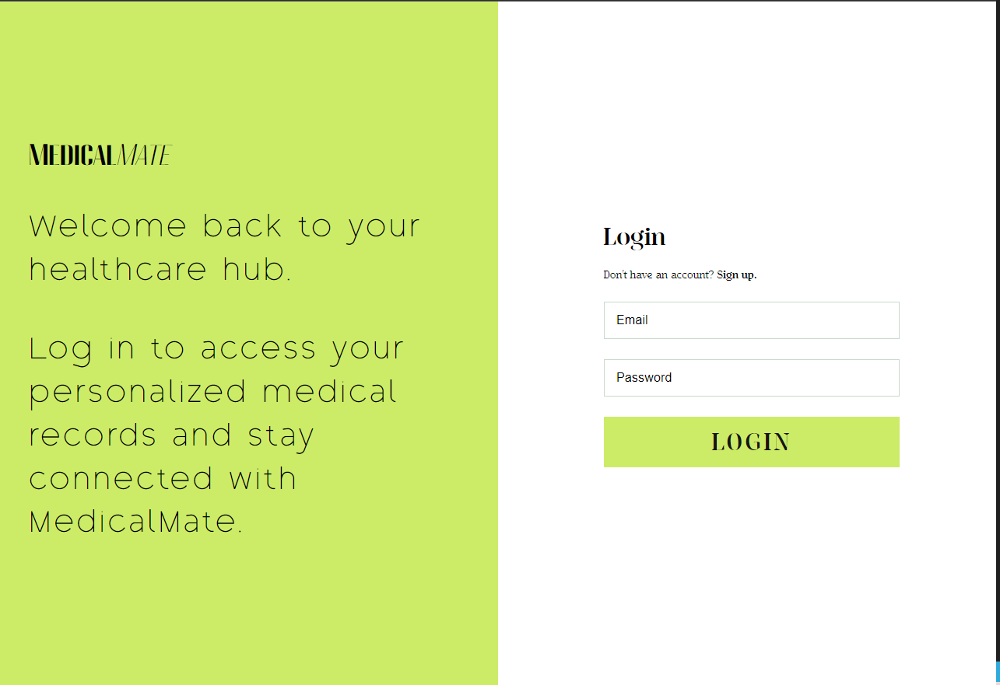
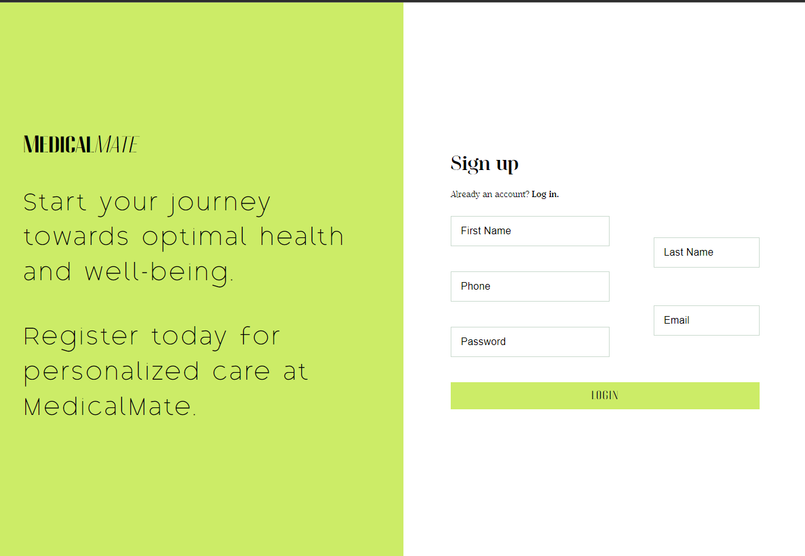

# MedicalMate (Front-end Part)

## Project Description

MedicalMate is an innovative online clinic based in the USA, offering a comprehensive range of medical services across 12 specialized departments. With the aim of providing convenient and accessible healthcare, MedicalMate allows individuals to easily schedule appointments with their desired department. Our dedicated team of healthcare professionals ensures that patients receive top-notch care and personalized attention. Whether you require medical consultation, diagnostic tests, or treatment, MedicalMate is committed to delivering exceptional service and enhancing the overall patient experience. Take advantage of our user-friendly platform and experience the convenience and satisfaction of receiving high-quality healthcare from the comfort of your own home.

## Motivation

The motivation behind creating MedicalMAte was to address the growing need for accessible and convenient healthcare services. Traditional clinic visits often involve long wait times, limited availability, and geographical constraints. MedicalMAte aims to overcome these challenges by providing an online platform where individuals can easily schedule appointments with various medical departments. This innovative approach not only saves time and eliminates the need for travel but also offers individuals the flexibility to receive medical care on their own terms. By leveraging technology and a team of skilled professionals, MedicalMAte strives to enhance the overall patient experience and make quality healthcare more accessible to a wider population.

## Tech Stack

- **HTML5** (for mark-up)
- **SCSS Modules** (for styles)
- **TypeScript** (for strict and structured front-end code)
- **React (TSX)** (for reactive application)
- **axios** (client-server communication)
- **EsLint** (linting code errors)
- **Prettier** (code formatter)
- **Vite** (projects builder)
- **Reeact Router Dom** (routing)
- **Material UI v5** (styled components)
- **libphonenumber-js** (phone mask)
- **Node.js** (projects dependecies)
- **npm** (package manager)
- **yarn** (package manager)

## Why React and TypeScript?

1. Efficient Development: React and TypeScript combination offers a streamlined development process. React's component-based architecture allows for modular development, making it easier to manage and reuse code components. TypeScript, with its static typing and strong type checking, helps catch errors during development, reducing bugs and enhancing code quality.

2. Scalability: React's virtual DOM efficiently handles rendering updates, resulting in a smoother user experience, even with complex interfaces. TypeScript's static typing helps in detecting potential scalability issues early on, allowing for better management of codebase as the project grows.

3. Enhanced Code Quality: TypeScript provides static typing, which enforces stricter type checking and helps prevent common coding errors. This leads to more robust and reliable code, reducing the likelihood of runtime errors and improving overall code quality.

4. Improved Maintainability: React's component-based architecture and TypeScript's static typing promote better code organization and maintainability. Components can be easily isolated and tested, making it simpler to debug and maintain the codebase over time.

5. Rich Ecosystem and Community Support: React and TypeScript have vibrant and active communities, which means access to a wealth of resources, libraries, and tools. This support ecosystem enables faster development, easier troubleshooting, and access to best practices, making it an excellent choice for the MedicalMate project.

## Launch Instruction

In order to optimize the project as much as possible, and distribute the launch both on the developer side and on the production side the Vite tool was used in this project. Vite is a fast and lightweight build tool and development server that optimizes the development workflow for modern web applications.

1. Create a folder on your local machine.
2. Go to the created folder and clone repository:

```bash
git clone https://github.com/HobiHo180294/medical-mate.git
```

3. Check if you haave installed Node.js on your local machine, if not the install [here](https://nodejs.org/en) (recommended version).

4. Install the package manager utility:

```bash
npm install --global yarn
```

5. Go to the front-end folder in the terminal and install all the dependencies:

```bash
yarn
```

6. If you have the error like below:
   

**then it is necessary to make these steps (tried on Windows)**:

- Click on the Search bar and type "PowerShell".
- Right-click on the "PowerShell" application and click "Run as administrator".
- Run the following command:

```shell
Set-ExecutionPolicy -ExecutionPolicy RemoteSigned
```

- Click "Y"

7. Retry the 5th step

8. Go to the work branch:

```bash
git checkout dev
```

9. Switch to the src folder in the terminal and install all the dependencies:

```bash
yarn
```

10. Run project on localhost:

```bash
yarn dev
```

11. Follow this route: http://localhost:5173/

## Project Build Modes

- Dev mode:

```bash
yarn dev
```

- Build mode:

```bash
yarn build
```

- Lint mode:

```bash
yarn lint
```

- Preview mode:

```bash
yarn preview
```

## Project Screenshots

### Intro Page



### Login Page



### Sign Up Page



## Client-Server Interaction

For communication between the front-end (React) and back-end (Spring) of the project, the Axios library is utilized, enabling HTTP protocol interaction for seamless data exchange and integration between the two components.

## Code Examples:

- **Login logic**

```javascript
const getLoginResult = async (data: Inputs) => {
  try {
    const response = await axios.post('http://localhost:8080/auth', data);
    return response;
  } catch (error) {
    return error;
  }
};
```

- **Registration logic**

```javascript
const getSignUpResult = async (data: Inputs) => {
  try {
    const response = await axios.post('http://localhost:8080/auth/registration', data);
    return response;
  } catch (error) {
    return error;
  }
```

- **Routing integration**

```javascript
<Routes>
  <Route path="/" element={<Layout header={<IntroHeader />} />}>
    <Route index element={<IntroPage />} />
  </Route>
  <Route path="/sign-up" element={<SignUpPage />} />
  <Route path="/login" element={<LoginPage />} />
  <Route path="*" element={<NotFoundPage />} />
</Routes>
```

## Conclusion

In conclusion, the front-end side of the MedicalMate project utilizes React and TypeScript, offering efficient development, scalability, enhanced code quality, improved maintainability, and benefiting from the rich ecosystem and community support. This technology stack ensures a smooth user experience, robust codebase, and streamlined development process, making MedicalMate a reliable and user-friendly online clinic platform.

## Useful Links

1. https://react.dev/
2. https://nodejs.org/en
3. https://developer.mozilla.org/en-US/
4. https://mui.com/material-ui/getting-started/
5. https://yarnpkg.com/
6. https://vitejs.dev/
7. https://www.typescriptlang.org/

## Project Links

1. [Figma](https://www.figma.com/file/ghvPEzKNHsSlatU90rv79s/MedicalMate?type=design&node-id=141%3A43&mode=dev)
2. [Front-end Repository](https://github.com/HobiHo180294/medical-mate)
3. [Back-end Repository](https://github.com/HobiHo180294/medical-mate-back-end)

⚠️ **Please note:** _Active development on this project is no longer maintained._

**© 2025 All Rights Reserved**
